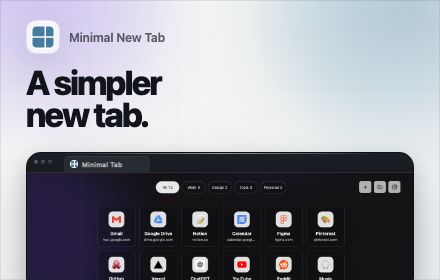
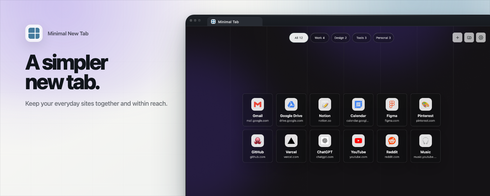

# Store media for Minimal Tab 1.7

Approved publication materials, refreshed on 6–7 October 2026. These assets
prepare the listing; their presence does not mean either store has published 1.7.
They are not included in the browser extension archives.

## Full Chrome Web Store descriptions

- [English, including What’s New 1.7](../../../docs/store/chrome-description-en.txt).
- [Russian, including What’s New 1.7](../../../docs/store/chrome-description-ru.txt).

Copy each complete plain-text file into the matching localized detailed-description
field. The two Chrome-specific descriptions must not be used unchanged for Firefox:
Firefox has different icon consent and no Chrome update-ready notice.
Separate Firefox release notes remain in `docs/whats-new-1.7-firefox-en.txt` and
`docs/whats-new-1.7-firefox-ru.txt` at the repository root.

## Screenshots

Ten opaque RGB PNGs, each 1280×800: five English and five Russian frames.
The user selected this Chrome-captured set for both Chrome Web Store and Firefox
Add-ons; no separate Firefox screenshot set is needed.

| Scene | English | Russian |
| --- | --- | --- |
| Overview | [en-01-overview.png](screenshots/en-01-overview.png) | [ru-01-overview.png](screenshots/ru-01-overview.png) |
| Folders | [en-02-folders.png](screenshots/en-02-folders.png) | [ru-02-folders.png](screenshots/ru-02-folders.png) |
| Emoji picker | [en-03-emoji.png](screenshots/en-03-emoji.png) | [ru-03-emoji.png](screenshots/ru-03-emoji.png) |
| Settings | [en-04-settings.png](screenshots/en-04-settings.png) | [ru-04-settings.png](screenshots/ru-04-settings.png) |
| Import and export | [en-05-backup.png](screenshots/en-05-backup.png) | [ru-05-backup.png](screenshots/ru-05-backup.png) |

These are byte-identical copies of the accepted caption refresh, with real product
captures and public demonstration sites. Personal links, accounts and browser
profiles are not pictured. The existing bundled wallpaper remains unchanged.

## Chrome promotional images

- [Small — 440×280](promo/en-promo-small-440x280.png).
- [Marquee — 1400×560](promo/en-promo-marquee-1400x560.png).

The headline is “A simpler / new tab.” in two lines. The marquee adds
“Keep your everyday sites together and within reach.” The old source-template
composition and styling remain; the logo and real product captures use release 1.7.
Both PNGs are 24-bit RGB, with no alpha channel. Intentional frame-edge crops are
part of the original composition; these are not the 1280×800 listing screenshots.

## Checks

The repository tests verify descriptions, compatibility caveats, relative README
links, all screenshot dimensions, opaque PNG color type and the exact final promo
bytes. Fresh independent local render/archive checks and side-by-side visual QA
preceded these copies. Browser runtime, release versions, permissions, installed
extensions and the existing release ZIPs are unchanged by this media-only update.
